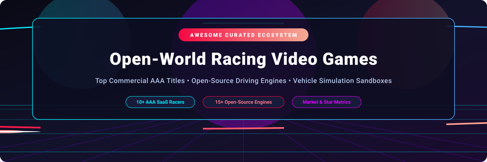

# Awesome Open-World Racing Video Game Ecosystem 🏎️ 💨

  

  
  
  
  
  

---

## 🌟 Top Open-World Racing Video Game Ecosystem

**Curated List of Commercial AAA SaaS Products & Open-Source Driving GitHub Projects**  
*Focused on Open-World Driving, Exploration, Off-Road Simulation & Open-Source Racing Engines*  

**Last updated: October 2026** 📅

---

### 📌 Overview & SEO Summary
Welcome to the ultimate curated directory of **open-world racing video games**, **open-source vehicle driving engines**, and **physics sandbox simulators**. Whether you are looking for AAA commercial open-world driving experiences (such as *Forza Horizon*, *The Crew Motorfest*, and *Need for Speed Unbound*), or high-performance open-source game engines (like *Godot*, *CARLA*, *Bullet Physics*, and *SuperTuxKart*), this list covers category leaders, engine frameworks, and simulation tools.

---

## 📑 Table of Contents
- [🏢 SaaS & Commercial Platforms](#-saas--commercial-platforms)
- [🔓 Open-Source GitHub Projects](#-open-source-github-projects)
- [🛠️ How to Contribute](#%EF%B8%8F-how-to-contribute)
- [📊 Star History](#-star-history)
- [🤝 Support & Sponsorship](#-support--sponsorship)
- [⚠️ Disclaimer](#%EF%B8%8F-disclaimer)

---

## 🏢 SaaS / Commercial Platforms

The global racing video game market is estimated at **$2.57B – $5.17B in 2026** (within the broader **$31.91B open-world gaming market**). The open-world racing sector is **highly concentrated** (winner-take-all dynamics dominated by major gaming conglomerates like Microsoft, EA, Take-Two Interactive, and Ubisoft).

| SaaS / Commercial Platform | Company / Owner | Valuation / Market Cap | Standard Edition Starting Price | Free Tier / Free Trial Limits | Description |
| :--- | :--- | :--- | :--- | :--- | :--- |
| **[Forza Horizon 5](https://forza.net/)** 🏎️ | Microsoft (Xbox Game Studios) | ~$3.8 Trillion | $59.99 (or via $9.99/mo Xbox Game Pass) | Free Play Days (periodic 3-day access for Xbox Game Pass subscribers) | **The definitive open-world racing game** — Mexico's diverse landscapes, 500+ cars, seasonal events, and arcade-sim handling. |
| **[Need for Speed Unbound](https://www.ea.com/games/need-for-speed/need-for-speed-unbound)** 🚨 | Electronic Arts (EA) | ~$52.93 Billion (Taken Private) | $69.99 | 10-hour free trial via EA Play subscription ($5.99/mo) | **Street racing with graffiti art style** — Lakeshore City, intense police chases, and deep customization. |
| **[Burnout Paradise Remastered](https://www.ea.com/games/burnout/burnout-paradise-remastered)** 💥 | Electronic Arts (EA) | ~$52.93 Billion (Taken Private) | $19.99 | 10-hour free trial via EA Play subscription ($5.99/mo) | **The classic open-world arcade racer** — Paradise City, crash modes, and stunt runs. |
| **[Grid Legends](https://www.ea.com/games/grid/grid-legends)** 🏁 | Electronic Arts (Codemasters) | ~$52.93 Billion (Taken Private) | $59.99 | 10-hour free trial via EA Play subscription ($5.99/mo) | **Racing with a story mode** — professional circuits and stadium events (included for diverse racing content). |
| **[Midnight Club: Los Angeles](https://www.rockstargames.com/midnightclub)** 🌃 | Take-Two Interactive (Rockstar Games) | ~$37.91 Billion | Delisted ($14.99 physical used market) | 1-hour free trial demo (historical Xbox 360 / PS3 demo) | **The classic open-world street racer** — Los Angeles, illegal street racing, and police chases. |
| **[Lego 2K Drive](https://lego2kdrive.com/)** 🧱 | Take-Two Interactive (2K Games) | ~$37.91 Billion | $59.99 | 2-hour free trial via PlayStation Plus / Steam Free Trial events | **Open-world Lego racing** — Bricklandia, vehicle customization, and family-friendly fun. |
| **[Fuel](https://www.codemasters.com/)** 🌵 | Take-Two Interactive (Codemasters / EA) | ~$37.91 Billion | Delisted ($9.99 physical used market) | Single-region demo (historical 2009 PC/console demo) | **The largest open-world racing game ever made** — 5,000 square miles of post-apocalyptic terrain. |
| **[The Crew Motorfest](https://www.ubisoft.com/game/the-crew-motorfest)** 🏝️ | Ubisoft | ~$800 Million (€690M) | $69.99 | 5-hour free trial (full game access with progress carryover) | **Ubisoft's open-world racing playground** — Hawaii's O'ahu island, diverse vehicle types (cars, bikes, boats, planes). |
| **[Driver: San Francisco](https://www.ubisoft.com/game/driver-san-francisco)** 🌉 | Ubisoft | ~$800 Million (€690M) | Delisted ($19.99 physical used market) | 1-hour free single-player demo (historical 2011 PC/console demo) | **The classic open-world driving game** — San Francisco, Shift mechanic, and story-driven missions. |
| **[Test Drive Unlimited Solar Crown](https://testdriveunlimited.ubisoft.com/)** 🏙️ | Nacon / Kylotonn | ~$80 Million (€70M) | $49.99 | 4-hour free trial (limited demo during Steam Next Fest / closed playtests) | **Open-world racing with Hong Kong Island** — luxury cars, social hubs, and exploration. |

---

## 🔓 Open-Source GitHub Projects

*Sorted by GitHub Stars_Count (Descending)* 🌟

- **[Godot Engine](https://github.com/godotengine/godot)**   
  **Multi-platform 2D and 3D game engine**, MIT licensed. Features built-in 3D physics, vehicle body nodes (`VehicleBody3D`), and terrain tools suited for open-world driving game development. 🎮

- **[OpenRCT2](https://github.com/OpenRCT2/OpenRCT2)**   
  **Open-source reimplementation of RollerCoaster Tycoon 2**, GPL-3.0 licensed. Open-world park construction with coaster track building and vehicle mechanics. 🎢

- **[Bullet Physics SDK](https://github.com/bulletphysics/bullet3)**   
  **Real-time 3D collision detection and rigid body dynamics library**, zlib licensed. Powering vehicle raycast physics, suspension, and wheel collision models across open-source racing games. ⚡

- **[CARLA Autonomous Driving Simulator](https://github.com/carla-simulator/carla)**   
  **Open-source simulator for autonomous driving research**, MIT licensed. Features massive urban open-world maps, digital twins, realistic vehicle dynamics, sensors, and weather control. 🚗

- **[PX4 Autopilot Engine](https://github.com/px4/PX4-Autopilot)**   
  **Open-source flight control software & rover vehicle navigation system**, BSD-3-Clause licensed. Used for open-world autonomous vehicle navigation and simulated rover racing. ✈️

- **[AirSim (Autonomous Vehicle Simulation)](https://github.com/microsoft/AirSim)**   
  **Open-source open-world simulator for AI driving & drones**, MIT licensed. Built on Unreal Engine with physical and visual realism for vehicle testing. 🚁

- **[O3DE (Open 3D Engine)](https://github.com/o3de/o3de)**   
  **AAA open-source 3D engine by Linux Foundation**, Apache-2.0 / MIT licensed. Includes photorealistic terrain rendering, vehicle physics components, and massive open-world streaming support. 🛠️

- **[NVIDIA Jetson Inference & Vision SDK](https://github.com/dusty-nv/jetson-inference)**   
  **Deep learning computer vision for autonomous vehicle navigation**, MIT licensed. Powering AI driving models in physical and simulated robotic vehicles. 🤖

- **[OpenTTD](https://github.com/OpenTTD/OpenTTD)**   
  **Open-source transport simulation game**, GPL-2.0 licensed. Open-world logistics and vehicle route management. 🚂

- **[SuperTuxKart](https://github.com/supertuxkart/stk-code)**   
  **Open-source 3D kart racing game**, GPL-3.0 licensed. Mario Kart-style arcade racing with 20+ tracks, character selection, online multiplayer, and open-world story mode maps. 🏎️

- **[Panda3D Game Engine](https://github.com/Panda3D/panda3d)**   
  **Open-source 3D framework for Python & C++**, BSD-3-Clause licensed. Used for developing lightweight 3D driving games and physics simulations. 🐼

- **[OGRE 3D Graphics Engine](https://github.com/ogrecave/ogre)**   
  **Scene-oriented 3D rendering engine**, MIT licensed. The core graphic renderer used by foundational open-source vehicle simulators like *Rigs of Rods* and *Stunt Rally*. 🎨

- **[Rigs of Rods](https://github.com/RigsOfRods/rigs-of-rods)**   
  **Open-source soft-body vehicle simulator sandbox**, GPL-3.0 licensed. Unique beam-node physics for realistic vehicle chassis deformation, off-road driving, and open-world terrain exploration. 🚜

- **[FlightGear Flight Simulator](https://github.com/FlightGear/flightgear)**   
  **Open-source flight simulator**, GPL-2.0 licensed. Features worldwide open-world terrain, realistic aerodynamics, and scenery streaming. ✈️

- **[Stunt Rally](https://github.com/stuntrally/stuntrally)**   
  **Open-source rally and stunt driving game**, GPL-3.0 licensed. Built on OGRE 3D and VDrift physics with 170+ tracks, loops, jumps, and open-world scenery maps. 🏁

- **[VDrift](https://github.com/vdrift/vdrift)**   
  **Open-source drift racing simulator**, GPL-2.0 licensed. Advanced car physics engine focused on realistic tire simulation, sliding, and drift mechanics. 💨

- **[TORCS (The Open Racing Car Simulator)](https://github.com/fmirus/torcs-1.3.7)**   
  **The original open-source 3D racing simulator**, GPL-2.0 licensed. Foundational modular engine used extensively in AI racing research and as the base for Speed Dreams. 🏆

---

## 🛠️ How to Contribute

Contributions are welcome! Follow these steps to submit new open-world racing games or driving software:

1. 🍴 **Fork** the repository.
2. 📝 **Add/edit** entries in `README.md` maintaining table/list structure and formatting.
3. 🔗 Include project title, official website/GitHub link, exact Stars_Count, license, and brief description.
4. 🚀 Submit a **Pull Request** with a descriptive summary of your changes.

---

## 📊 Star History

---

## 🤝 Support & Sponsorship

If you find this open-world racing game repository useful, please consider supporting the project:

- ⭐ **Star** this repository to increase visibility!
- 🔀 **Fork** and share with fellow developers & gamers.
- ☕ **Sponsor & Buy Me a Coffee**: Support ongoing open-source curation via the [GitHub Sponsor Dashboard](https://github.com/sponsors/ishandutta2007).

---

## ⚠️ Disclaimer

- This is a **community-curated** list — not exhaustive and not an endorsement. ℹ️
- Open-world racing games often support mods and custom content. **Verify mod sources** — malicious mods can compromise systems. 🔒
- The open-source ecosystem provides strong physics, track, and vehicle foundations, but AAA open-world maps, licensed vehicles, and professional force-feedback fidelity remain primarily commercial offerings. 🏎️

---

  <b>Made with ❤️ for racing game enthusiasts, open-world drivers, and open-source game developers.</b>

